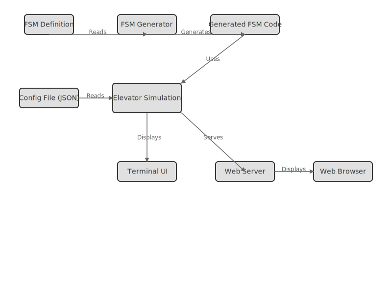

# Ascend – Elevator Optimization & FSM Simulation

Ascend is a simulation project about how elevators decide where to go next in multi-floor buildings.  
It models real elevator logic, the way they respond to up/down calls, manage multiple requests, and pick the best next stop, using C/C++ and finite state machines (FSMs).

The goal is to explore how real-time, event-driven systems work, and how FSMs can make that logic more modular and maintainable. It’s also a way to practice code generation and structured system design in C++.

---

## Project Overview

Modern elevators don’t just go to the nearest floor. They make decisions based on direction, waiting time, and system load.  
Ascend aims to capture that decision-making process in a simplified but realistic way.

The project teaches or demonstrates:

- How to build event-driven simulations  
- How to design and implement FSM-based logic  
- How to auto-generate FSM code from simple definitions  
- How to balance optimization and simplicity in algorithms  

---

## What’s an FSM?

A **Finite State Machine (FSM)** describes a system that can be in one of several **states**, changing from one to another when certain **events** happen.

In other words:
```
Idle → MovingUp → DoorOpen → Idle
```


Ascend doesn’t just use FSMs, it generates them.  
It can read external `.fsm` files and turn them into C++ code, so the elevator’s behavior can be redefined without editing the main program.  
That makes it part simulator, part code generator.

---

## Roadmap

**Phase 1 — Basic Simulation**  
- [ ] Floors, elevators, and event sequence  
- [ ] Simple optimization (nearest elevator selection)

**Phase 2 — FSM Integration**  
- [ ] Define elevator behavior through FSM files  
- [ ] Add FSM Generator module (`.fsm` → `.h/.cpp`)  
- [ ] Log state transitions

**Phase 3 — Advanced Features**  
- [ ] Multiple elevator coordination  
- [ ] Time-based (tick-driven) simulation  
- [ ] Event queue and asynchronous handling  
- [ ] Terminal visualization (ASCII UI or ncurses)

**Phase 4 — Extras (Experimental)**  
- [ ] Adaptive/learning elevator logic  
- [ ] Configurable parameters from JSON/INI  
- [ ] Optional GUI or web interface  

---

## Architecture

Here’s the current top-level structure of the system:

<p align="center">
  
</p>

---